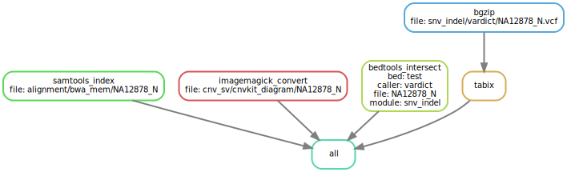

# :snake: hydra-genetics/misc

### Snakemake module containing general steps for indexing, zipping, converting etc.


[](https://opensource.org/licenses/gpl-3.0.html)

## :speech_balloon: Introduction

This module contains rules to format or index files. The syntax is rather general and might need adapting when
importing this module. Files can be bgzipped and indexed, `.bam`-files indexed, `.vcf`-files intersected with
`.bed`-files or `.pdf`-files may be converted to `.png` to reduce their size. Input data should be specified
via `samples.tsv` and `units.tsv`.

## :heavy_exclamation_mark: Dependencies

In order to use this module, the following dependencies are required:

[](https://github.com/hydra-genetics/)
[](https://pandas.pydata.org/)
[](https://www.python.org/)
[](https://snakemake.readthedocs.io/en/stable/)
[](https://sylabs.io/docs/)

## :school_satchel: Preparations

### Sample and unit data

Input data should be added to [`samples.tsv`](https://github.com/hydra-genetics/prealignment/blob/develop/config/samples.tsv)
and [`units.tsv`](https://github.com/hydra-genetics/prealignment/blob/develop/config/units.tsv).
The following information need to be added to these files:

| Column Id | Description |
| --- | --- |
| **`samples.tsv`** |
| sample | unique sample/patient id, one per row |
| tumor_content | ratio of tumor cells to total cells |
| **`units.tsv`** |
| sample | same sample/patient id as in `samples.tsv` |
| type | data type identifier (one letter), can be one of **T**umor, **N**ormal, **R**NA |
| platform | type of sequencing platform, e.g. `NovaSeq` |
| machine | specific machine id, e.g. NovaSeq instruments have `@Axxxxx` |
| flowcell | identifer of flowcell used |
| lane | flowcell lane number |
| barcode | sequence library barcode/index, connect forward and reverse indices by `+`, e.g. `ATGC+ATGC` |
| fastq1/2 | absolute path to forward and reverse reads |
| adapter | adapter sequences to be trimmed, separated by comma |

### `.bed`-files

In order to run `bedtools_intersect`, add a dict of `.bed`-file paths to the stanza `bed_files` of the
appropriate caller, e.g. `mutectcaller`.

## :white_check_mark: Testing

The workflow repository contains a small test dataset `.tests/integration` which can be run like so:

```bash
cd .tests/integration
snakemake -s ../../Snakefile -j1 --use-singularity
```

## :rocket: Usage

To use this module in your workflow, follow the description in the
[snakemake docs](https://snakemake.readthedocs.io/en/stable/snakefiles/modularization.html#modules).
Add the module to your `Snakefile` like so:

```bash
module misc:
    snakefile:
        github(
            "hydra-genetics/misc",
            path="workflow/Snakefile",
            tag="v0.1.0",
        )
    config:
        config


use rule * from misc as misc_*
```

### Output files

The following output files should be targeted via another rule:

| File | Description |
|---|---|
| `{file}.bam.bai` | `.bam`-file index |
| `{file}.gz` | `bgzip`-compressed file |
| `{file}.gz.tbi` | `bgzip`-compressed file index |
| `{file}.png` | `.png` version of `.pdf` |
| `{module}/{caller}/{file}.{bed}.vcf` | `.vcf`-file intersected with `.bed`-file |

## :judge: Rule Graph


